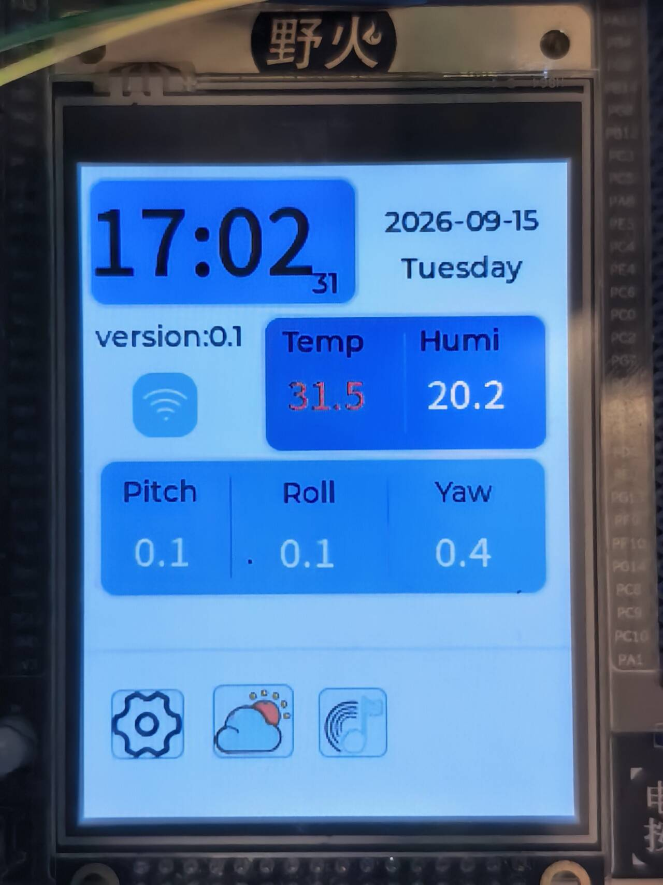
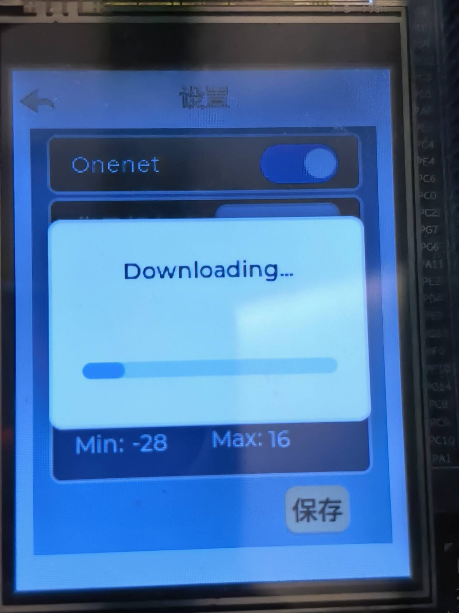
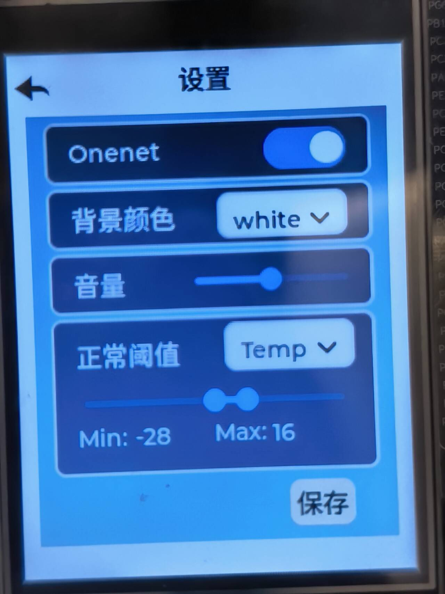
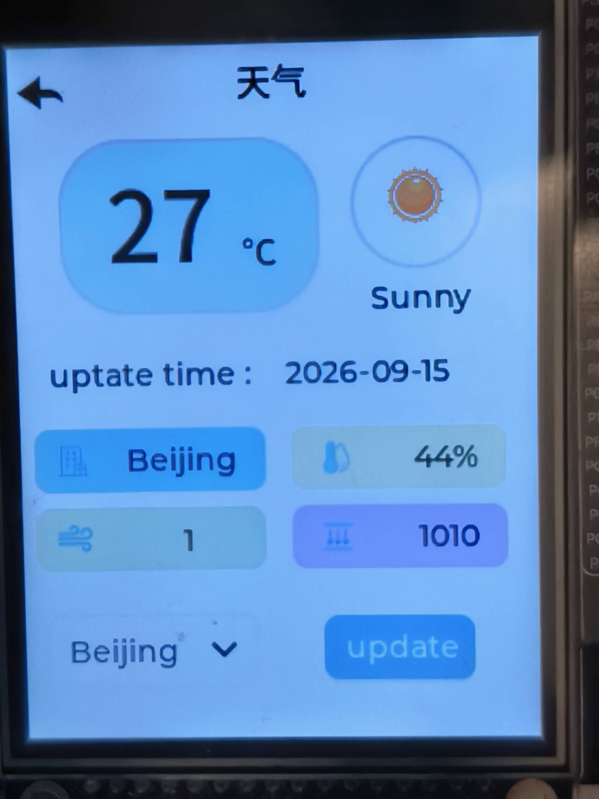
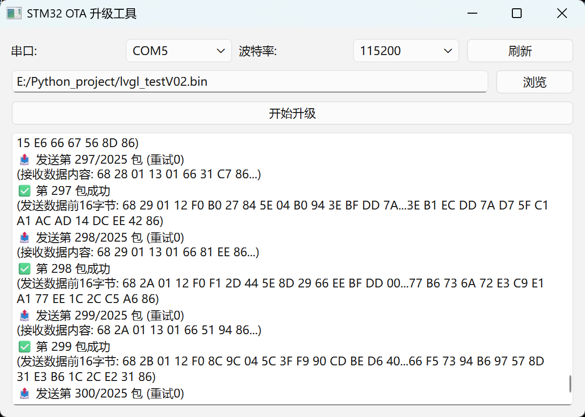

# STM32F103 FreeRTOS 多线程物联网环境监测系统

基于 STM32F103 + FreeRTOS 的多线程物联网环境监测系统，集成 DHT11 温湿度采集、MPU6050 三轴角度采集、ESP8266 Wi-Fi 通信、OneNET 云平台双向通信、RTC 计时与校时、心知天气、LVGL 触摸屏交互、阈值报警、参数断电保存与高可靠 OTA 升级。

## 项目简介

本项目是一个面向物联网环境监测场景的嵌入式综合项目。系统以 STM32F103 为主控，运行 FreeRTOS 实时操作系统，通过多任务方式完成传感器采集、屏幕显示、触摸交互、Wi-Fi 通信、云端数据上传与下行控制、RTC 校时、天气获取、参数保存和 OTA 升级等功能。

设备可定时将温湿度、三轴角度等数据上传至 OneNET 云平台，并接收云端下发的控制指令，用于控制 LED 等外设；同时支持 RTC 本地计时，并定期获取服务器时间戳对 RTC 进行校准。天气功能内置四个地址，用户点击更新后可获取心知天气数据并显示在屏幕上。

本地采用 240×320 电阻触摸屏 + LVGL 构建交互界面，用户可以拖动滑条设置温湿度、角度报警阈值，超限数据会变红示警；设置可保存到非易失存储，断电重启后自动恢复。

系统还实现了高可靠 OTA 升级：上位机通过串口发送加密固件包，STM32 接收后保存到外部 Flash，每页保存校验信息，Bootloader 校验通过后更新固件，降低升级失败或数据被篡改的风险。

## 硬件选型

| 模块 | 型号/说明 |
|---|---|
| 开发板 | 野火霸道 V2 |
| 主控 | STM32F103ZET6 |
| RTOS | FreeRTOS（CMSIS-RTOS V2 接口） |
| 开发环境 | VSCode / STM32CubeMX / Ozone |
| 屏幕 | 240×320 电阻触摸屏（ILI9341 + XPT2046，FSMC + SPI） |
| Wi-Fi 模块 | ESP8266（UART + AT 指令驱动） |
| 上位机 | Python + Qt 自制上位机（UART + 自定义协议） |
| 传感器 | DHT11（单总线协议）、MPU6050（IIC） |
| 外部 Flash | W25Q64（SPI） |

## 功能特性

- **多线程系统**：基于 FreeRTOS 创建采集、显示、通信、OTA 等任务。
- **环境采集**：DHT11 采集温湿度，MPU6050 采集三轴角度。
- **云端通信**：ESP8266 连接 Wi-Fi，与 OneNET 云平台进行数据上传和指令下发。
- **云端控制**：OneNET 下发数据到 STM32，控制 LED 开关。
- **多城市天气**：内置四个地址选项，点击更新后获取心知天气数据并显示。
- **RTC 计时与校时**：RTC 实时计时，定期获取服务器时间戳校准 RTC。
- **本地显示**：LVGL + 240×320 电阻触摸屏显示传感器数据、时间、天气和设置界面。
- **阈值报警**：通过屏幕滑条设置温湿度、角度范围，超限后对应数值变红示警。
- **参数保存**：报警阈值等设置可点击保存，断电重启后自动恢复。
- **高可靠 OTA**：上位机通过串口发送加密固件包，STM32 接收后解密并保存到外部 Flash，每页保存校验信息，Bootloader 校验后升级。
- **掉电保护与防篡改**：固件分页校验、整包校验、加密传输，降低升级失败或数据被篡改的风险。

## FreeRTOS 任务说明

系统基于 FreeRTOS 多任务架构，主要任务包括：

| 任务 | 职责 |
|---|---|
| `HardwareInitTask` | 系统初始化，优先级最高，负责 LCD、触摸、DHT11、MPU6050、ESP8266 等初始化。 |
| `uart3ReceiveTask` | 接收 ESP8266 串口数据，写入 `xESP8266StreamBuffer`。 |
| `uart1ReceiveTask` | 接收 PC 上位机串口数据，写入 `xPCStreamBuffer`，用于 OTA。 |
| `ESP8266CommTask` | 处理 ESP8266 通信、OneNET 数据上传与下行控制、心知天气请求、服务器时间戳校时。 |
| `PCCommTask` | 处理 PC 串口 OTA 数据，包括解析、解密、写外部 Flash 和校验。 |
| `sensorDataUpdateTask` | 周期采集 DHT11 温湿度和 MPU6050 三轴角度和 RTC 时间获取，并进行阈值判断。 |
| `LvHandlerTask` | LVGL 界面刷新、触摸交互、滑条设置、超限数值变红显示。 |
| `sysDataStorageTask` | 保存报警阈值等信息。 |
| `debug_MonitorTask` | 调试监控任务。 |

任务间通过任务通知、StreamBuffer 和消息队列通信：

| 通信对象 | 类型 | 用途 |
|---|---|---|
| `xESP8266StreamBuffer` | StreamBuffer | ESP8266 串口数据流。 |
| `xPCStreamBuffer` | StreamBuffer | PC 串口数据流。 |
| `xESP8266CmdQueue` | Queue | ESP8266 命令队列。 |
| `xCmdDisplayQueue` | Queue | 显示命令队列。 |
| `xWeatherCityQueue` | Queue | 天气城市切换队列。 |

## 界面展示

### 主界面

### OTA 界面

### 设置界面

### 天气界面

### 上位机界面

## 用户配置
在App/User/Service/NET/app_config.h文件中配置自己的wifi密码等信息
